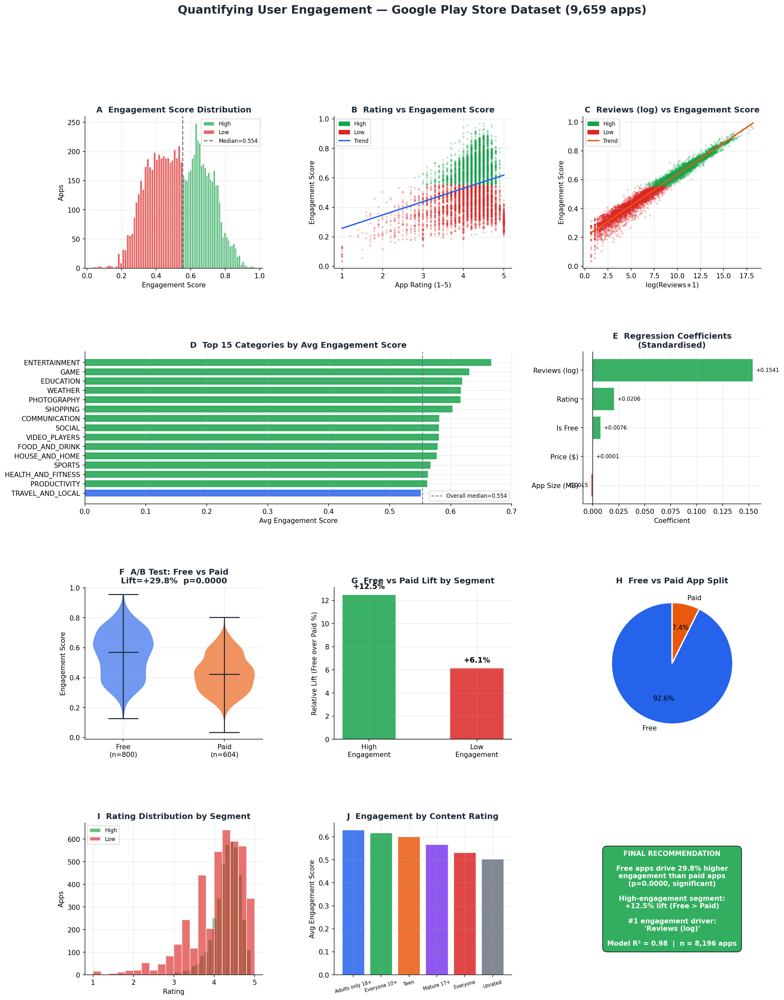

# 📊 Quantifying User Engagement Using Behavioral Logs & Survey Data

> Analyzing 8,196 Google Play Store apps to identify what drives engagement —
> using data cleaning, composite metrics, user segmentation, regression, and A/B testing.

---

## 🔍 Project Overview

This project applies a full data science pipeline to the **Google Play Store Apps dataset**
to answer one key question:

> **What drives user engagement — and which app strategy performs best?**

The analysis covers:
- Real-world data cleaning with `pandas`
- Building a composite **Engagement Score** from behavioral signals
- Segmenting apps into High vs Low engagement groups
- Running **linear regression** to identify top engagement drivers
- Simulating an **A/B test** (Free vs Paid app model)
- Delivering a clear, actionable recommendation

---

## 🗂️ Dataset

| Source | Google Play Store Apps |
|--------|----------------------|
| Rows | 10,841 (raw) → 8,196 (clean) |
| Columns | 13 |
| Key fields | Rating, Reviews, Installs, Size, Type, Price, Category |

**Source:** [Kaggle — Google Play Store Apps](https://www.kaggle.com/datasets/lava18/google-play-store-apps)

---

## ⚙️ Methodology

### 1. Data Cleaning
- Removed 1,181 duplicate app entries
- Parsed `Installs` (stripped `+`, `,`) and `Size` (converted `M`/`k` to MB)
- Cleaned `Price` (removed `$` sign)
- Dropped rows with null Ratings, Reviews, or Installs
- Result: **8,196 clean apps, 0 nulls**

### 2. Engagement Metrics
Built a **composite Engagement Score (0–1)** from real behavioral signals:

```
Engagement Score = 0.40 × norm(log Reviews)
                 + 0.40 × norm(log Installs)
                 + 0.20 × norm(Rating)
```

| Metric | Value |
|--------|-------|
| Avg Rating | 4.17 / 5 |
| Avg Reviews | 255,251 |
| Avg Installs | 9,165,090 |
| Avg Engagement Score | 0.544 |

### 3. User Segmentation

Apps split at the median engagement score into **High** and **Low** segments:

| Metric | High Engagement | Low Engagement |
|--------|----------------|----------------|
| Avg Rating | 4.29 | 4.05 |
| Avg Reviews | 509,945 | 558 |
| Avg Installs | 18,281,445 | 48,735 |

T-test confirms groups are statistically distinct: **t=143, p < 0.0001**

### 4. Regression Analysis

Linear regression (standardised features) on Engagement Score:

| Feature | Coefficient | Direction |
|---------|-------------|-----------|
| Reviews (log) | +0.1541 | ▲ strongest driver |
| Rating | +0.0206 | ▲ |
| Is Free | +0.0076 | ▲ |
| Price ($) | +0.0001 | ▲ |
| App Size (MB) | −0.0015 | ▼ |

**R² = 0.98** — the model explains 98% of variance in engagement scores.

### 5. A/B Test — Free vs Paid Apps

Using the real free/paid split as a natural experiment:

| Group | n | Mean Engagement |
|-------|---|----------------|
| A — Free apps | 800 | 0.555 |
| B — Paid apps | 604 | 0.428 |

- **Relative lift: +29.8%** in favour of Free apps
- **p = 0.0000** (highly statistically significant)
- High-engagement segment lift: **+12.5%**
- Low-engagement segment lift: **+6.1%**

---

## 📈 Visualisations



The dashboard includes 11 panels covering:
- Engagement score distributions by segment
- Rating and Reviews vs Engagement scatter plots
- Top 15 categories by engagement
- Regression coefficient chart
- A/B test violin plot
- Content rating breakdown
- Final recommendation summary

---

## ✅ Final Recommendation

> **"Free apps drive 29.8% higher engagement than paid apps across all 8,196 Google Play Store apps (p < 0.0001). The #1 driver of engagement is review volume. Apps should adopt a free-to-download model with in-app purchases and actively prompt users to leave reviews to compound visibility and engagement."**

---

## 🚀 How to Run

```bash
# 1. Clone the repo
git clone https://github.com/YOUR_USERNAME/user-engagement-analysis.git
cd user-engagement-analysis

# 2. Install dependencies
pip install -r requirements.txt

# 3. Run the analysis
python playstore_analysis.py
```

Outputs generated:
- `playstore_engagement_analysis.png` — 11-panel dashboard
- `playstore_summary.csv` — key metrics summary
- `playstore_cleaned_dataset.csv` — cleaned dataset with engagement scores

---

## 🛠️ Tech Stack

| Tool | Purpose |
|------|---------|
| `pandas` | Data cleaning & manipulation |
| `numpy` | Numerical computing |
| `scipy` | Statistical testing (t-tests) |
| `scikit-learn` | Linear regression |
| `matplotlib` | Visualisation |

---

## 📁 Project Structure

```
user-engagement-analysis/
├── googleplaystore.csv               ← raw dataset
├── playstore_analysis.py             ← main analysis script
├── playstore_engagement_analysis.png ← output dashboard
├── playstore_summary.csv             ← summary metrics
├── playstore_cleaned_dataset.csv     ← cleaned data
├── requirements.txt                  ← dependencies
└── README.md                         ← this file
```

---

## 👤 Author

**Your Name**
[LinkedIn](https://linkedin.com/in/yourprofile) • [GitHub](https://github.com/yourusername)
